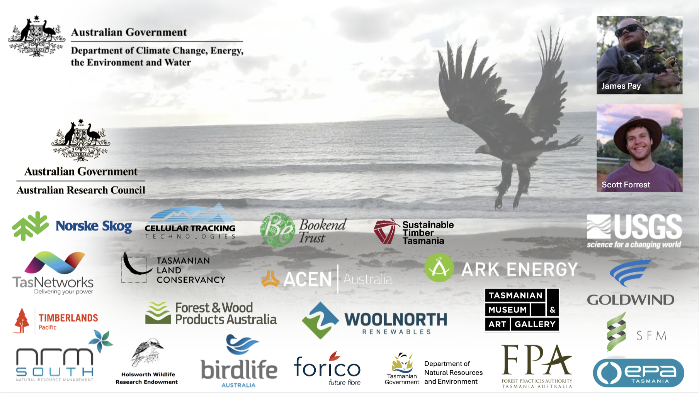

**Presentation description**  
James Pay and Scott Forrest talk about work that they have been doing modelling wedge-tailed eagles in relation to wind turbines in Tasmania. James talks about modelling the Tasmania-wide spatial mapping of risk for the wedgies, and Scott talks about an assessment of local-scale avoidance behaviour of turbines. They used high-frequency GPS tracking data (from 6 second to 15-minute fix intervals) from 78 individuals that was collected over multiple years, which presents a number of challenges and opportunities for modelling.

**James Pay**
James Pay is a postdoctoral research fellow at the University of Tasmania. His research is focused on the conservation biology and behavioral ecology of threatened birds, and he has worked with a number of industry partners to assess the impacts of infrastructure on threatened species. 

**Scott Forrest**
Scott Forrest is a postdoctoral research fellow at the University of Tasmania, after recently completing his PhD at the Queensland University of Technology in conjunction with CSIRO. He researches animal movement methods and applications, with a particular focus on generating animal movement predictions, often through step selection functions and their extensions.

Due to requirements of the funder, the recording is not yet publicly available. Check back later for a link to the recording, or contact Scott Forrest (scottwforrest@mgail.com) if you would like to access the recording.

<!-- **Recording can be found here:** [https://youtu.be/DYXI1z-wONM](https://youtu.be/DYXI1z-wONM) -->

