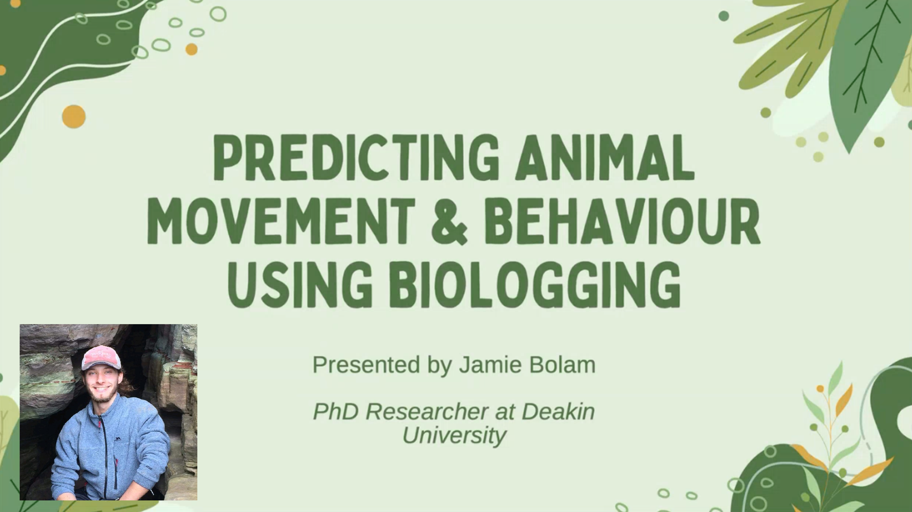

**Presentation description**  
Jamie Bolam shares the plan for his PhD at Deakin University. His PhD has two pillars; the first is improving methods of wildlife behaviour classification based on accelerometers. The second is applying these findings to the world’s first stubble quail (*Coturnix pectoralis*) tracking study to elucidate their movement, behaviour & population dynamics in Victoria. The aim is to track 100 quail over the next 2.5 years. Findings are expected to influence Victoria state stubble quail hunting policy, and hopefully reveal ways to promote biodiversity-friendly agricultural & pastoral management.

**Jamie Bolam**
Jamie is a wildlife Conservationist from the UK. After graduating from the University of Oxford with a MSc in Biodiversity, Conservation & Management, he worked in Taiwan for 1.5 years as a wildlife conservation consultant. This work focused on Formosan black bear monitoring via telemetry & camera trapping, human-bear conflict policy development and involved close collaboration with Taiwan’s indigenous communities. He also supported various monitoring, conflict mitigation & conservation projects on leopard cats, yellow-throated martens, wild boar & more.

**Recording can be found here:** [https://youtu.be/fB-opV-qDYs](https://youtu.be/fB-opV-qDYs)