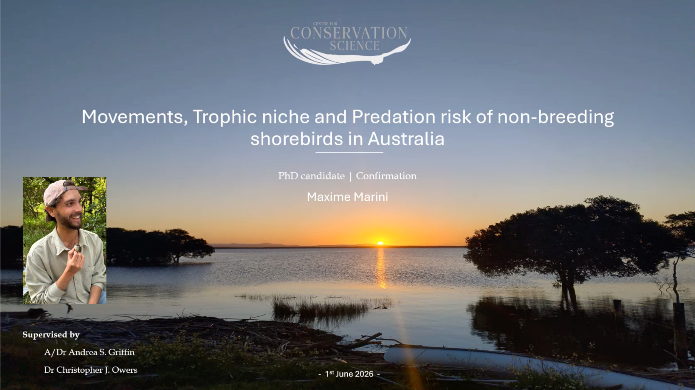

**Recording can be found here:** [https://youtu.be/wNq7AE9dBY8](https://youtu.be/wNq7AE9dBY8)

**Presentation description**  
Australian estuaries support around 50 shorebird species, and most are declining sharply (~5% per year). This is largely due to habitat loss across the East Asian-Australasian Flyway. While daytime roost use is well studied, knowledge gaps remain around night and low-tide movements, site partitioning between species, and which habitats and food sources most strongly drive shorebird presence and abundance. My thesis aims to address these gaps using VHF telemetry, GPS-accelerometer tracking, stable isotope analysis, and GIS habitat data to investigate site fidelity and movement, foraging and roosting behaviour, habitat change, and predation risk. Together, I aim to build a multi-scale framework that can efficiently guide shorebird habitat conservation amid growing pressure from urbanisation and climate change.

**Maxime Marini**
Originally from France, I am a field ecologist specialising in population dynamics and wildlife monitoring, with experience spanning from Arctic botany and fauna surveys in Norway to Alpine fauna trapping and telemetry in France. I am now a PhD student at the Center for Conservation Science, University of Newcastle, studying the movement and spatial ecology of resident and migratory shorebirds in Australian estuaries, where I aim to contribute to producing accessible data and efficient conclusions to support real-world conservation decisions, locally.

